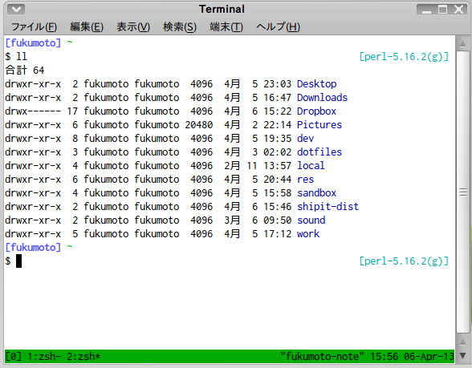

# ターミナルとシェル入門

___
## CUI(CLI)
macOSもLinuxも、Windowsと同じく<ruby>GUI<rt>ジーユーアイ</rt></ruby>で操作可能です。

ですが、プログラミングをする上で<ruby>CUI<rt>シーユーアイ</rt></ruby> (<ruby>CLI<rt>シーエルアイ</rt></ruby>) は避けられません。

- CUI ... Character User Interface
- CLI ... Command Line Interface

これらは文字によって操作を行うインターフェイスのことを指します。
- Windowsならば、コマンドプロンプトに該当します。
- Linux/macOSではターミナルに該当します。

___
## CUI(CLI)
実際にCUI(CLI)を操作して体験してみましょう。

___
## ターミナルとシェル
プログラムの起動や制御をCUI(CLI)で行うプログラムのことを、**シェル**と呼びます。

ターミナルを開くと、シェルを使った操作が出来るようになります。



___
## ターミナルの開き方(macOS)
Launchpadなどから「ターミナル」を選択し、起動します。

<small>ターミナルは頻繁に起動するため、Dockへ追加しておくことをおすすめします。</small>


△ターミナルのアイコン

___
## シェルで使えるコマンド集
Perl入学式の中でもよく使うコマンドを紹介します。

シェルには、これから紹介する以外にも様々なコマンドがあります。

OSやシェルの種類によって使えるもの、使えないものがありますが、使いこなせば作業の負担を軽減することができます。

参考図書：<a href="https://system-admin-girl.com/" target="_blank">まんがでわかるLinux シス管系女子</a>

___
## プロンプト
ターミナルでは入力待ちの時に**プロンプト**が表示されます。

<ruby>zsh<rt>ズィーシェル</rt><ruby>, macOS Catalina(10.15)
```zsh
%
```

<ruby>Bash<rt>バッシュ</rt></ruby>, MSYS32, macOS Mojave(10.14)以前の標準, Linux
```bash
$
```

これら行頭に表示される記号は「入力受付の状態」を示すものです。この記号は入力する必要はありません。

また、プロンプトはカスタマイズも可能です。興味がある人はGoogleで「プロンプト カスタマイズ」等で検索してみましょう。

___
## コマンド集(ls)
### [両ユーザ向け]
```bash
$ ls
デスクトップ ダウンロード (以下略)
```
`ls`は、現在いるディレクトリにあるファイルを表示します。

コマンド名は'list segments'の頭文字を取ったものです。

`ls -a`は、`.`(ドット)で始まる、通常は見えない隠しファイルも含め、すべて表示します。

このように、コマンドに追加の命令をつけて動作を変えることができます。

これを<ruby>引数<rt>ひきすう</rt></ruby>といいます。

___
## コマンド集(pwd)
### [両ユーザ向け]
```bash
$ pwd
/home/username
```
`pwd`は、現在いるディレクトリの場所（パス）を表示します。

コマンド名は'print working directory'の頭文字を取ったものです。

___
## コマンド集(mkdir)
### [両ユーザ向け]
```bash
$ mkdir sample
$ ls
sample デスクトップ ダウンロード (以下略)
```
`mkdir DIRECTORY`は、`DIRECTORY`というディレクトリを作ります。

コマンド名は'make directory'を短縮したものです。

___
## コマンド集(cd)
### [両ユーザ向け]
```bash
$ cd sample
$ pwd
/home/username/sample
$ cd ..
$ pwd
/home/username
```
`cd DIRECTORY`で、`DIRECTORY`に移動します。

コマンド名は'change directory'を短縮したものです。

上の階層のディレクトリは`..`で表示されます。


___
## コマンド集(touch)
### [両ユーザ向け]
```bash
$ touch sample1 sample2
$ ls
sample1 sample2
```
`touch`には2つの役割があります。`touch FILENAME` とした時・・・
- FILENAME がすでに存在する場合には、ファイルのアクセス日時と更新日時を現時刻に書き換える
- FILENAME が存在しない場合には、空のファイルを生成する

___
## コマンド集(rm)
### [両ユーザ向け]
```bash
$ ls
sample1 sample2
$ rm sample1
$ ls
sample2
```
`rm [OPTION] FILENAME`は、`FILENAME`のファイルを削除します。`FILENAME1 FILENAME2`のように半角スペースで区切ることで複数個指定することができます。

コマンド名は'remove'を短縮したものです。

___
## コマンド集(rmdir)
### [両ユーザ向け]
```bash
$ mkdir del_sample
$ ls
del_sample
$ rmdir del_sample
$ ls
$
```
`rmdir DIRNAME`は、`DIRNAME`のディレクトリを削除します。ただしディレクトリは空である必要があります。

コマンド名は'remove directory'を短縮したものです。

ディレクトリの中身ごとを削除するときは、先に紹介した`rm -r DIRNAME`で削除します。

`-r`という引数は<ruby>recursive<rt>リカーシブ</rt></ruby>（再帰的）を意味しています。

___
## コマンド集(cp)
### [両ユーザ向け]
```bash
$ ls
sample2
$ cp sample2 sample1
$ ls
sample1 sample2
```
`cp [OPTION] SOURCE DEST`は、`SOURCE`を`DEST`にコピーします。

コマンド名は'copy'を短縮したものです。

ディレクトリをコピーするときは、`[OPTION]`として`-r`を指定し、`cp -r SOURCE DEST`でコピーしなければなりません。

___
## コマンド集(mv)
### [両ユーザ向け]
```bash
$ ls
sample1 sample2
$ mv sample1 sample_text
$ ls
sample_text sample2
```
`mv [OPTION] SOURCE DEST`で、`SOURCE`を`DEST`に移動します。

コマンド名は'move'を短縮したものです。

ファイルやディレクトリの名前を変更する為にも使えます。

___
## コマンド集(start)
### [Windowsユーザ向け]
```bash
$ start .
```
`start [DIRECTORY]`で、`DIRECTORY`をExplorerというファイルマネージャで開きます。

`start`は対象となるファイルの種類によって動作が変わります。

例えばディレクトリが対象ならば上記のようにExplorerで表示、テキストならばテキストエディタで表示...  という動作をします。

___
## コマンド集(open)
### [macOSユーザ向け]
```bash
$ open .
```

`open [DIRECTORY]`で、`DIRECTORY`をFinderというファイルマネージャで開きます。

`open`は対象となるファイルの種類によって動作が変わります。

例えばディレクトリが対象ならば上記のようにFinderで表示、テキストならばテキストエディタで表示...  という動作をします。

___
## 練習問題
1. **ホームディレクトリ**に`perl-entrance`というディレクトリを作りましょう。

  ホームディレクトリとは、ユーザごとに用意された作業場所のようなものです。

  `cd`とだけ入力してエンターキーを押すと、ホームディレクトリに移動します。

2. 作った`perl-entrance`ディレクトリの中に移動しましょう。

3. **カレントディレクトリ**のパスを`pwd`で表示し、その後に、`start`もしくは`open`を使って、ファイルマネージャで開いてみましょう。

    現在いるディレクトリをカレントディレクトリと言います。


---
# エディタ入門

___
## エディタ
コードを書く時に最も使う道具、それがエディタです。

プログラミングに特化した様々なエディタが開発されていますが、Perl入学式ではその中でもVisual Studio Codeを紹介します。

特にこだわりのない方は、今回紹介するVisual Studio Codeを試してみましょう。

もちろん、EmacsやVim、サクラエディタなど、既に使い慣れているエディタがある方はそちらをお使いください。

___
## Visual Studio Code

<a href="https://code.visualstudio.com/" target="_blank">Visual Studio Code - Code Editing. Redefined</a>へアクセスし、｢Download｣をクリックします。

___
## Visual Studio Code

### Windows
ダウンロードした`VSCodeUserSetup-**.exe`をダブルクリックすると、インストールが開始されます。

`**` としたところにはバージョン番号が入ります。

インストール後は、スタートメニューから「Visual Studio Code」をダブルクリックすればVisual Studio Codeが起動します。

インストール直後は自動的に起動します。

___
## Visual Studio Code

### macOS
ダウンロードした`VSCode-darwin-stable.zip`をダブルクリックすると、`Visual Studio Code.app`が生成されます。

これをダブルクリックすればVisual Studio Codeが起動します。

「"Visual Studio Code.app"はインターネットからダウンロードされたアプリケーションです」という警告が出た場合、「開く」をクリックします。

___
## Visual Studio Code

### 日本語化
メニューが英語でとっつきにくい場合には、日本語化することが可能です。

1. ウィンドウ左上の View -> Command Palette から `Configure Display Language`と入力して候補を選択する。

1. Install Addicional Languages を選択する。

1. 左側のメニューから「日本語」を選択し、緑色の「Install」ボタンを押す。

1. 一度Visual Studio Codeを閉じて、再度起動する。

1. 英語表記に戻す場合には、1. から en を選択することで英語メニューになります。

___
## Visual Studio Code

### ファイルを開く
- 左上メニューの ファイル -> (Windows版)ファイルを開く(macOS)開く

### ファイルを保存する
- 左上メニューの ファイル -> 保存

___
## 練習問題
1. `perl-entrance`ディレクトリ内に`profile.txt`という空のファイルを用意して、Visual Studio Codeで編集します。

  ファイルの中には、「使用したコマンド1つとその説明」、「今使用しているOS」、「使用しているエディタ」を書いて保存します。

1. ターミナルを使って、`profile.txt`を`profile2.txt`という名前でコピーしましょう。

1. コピー元の`profile.txt`をターミナルから削除しましょう。

1. コピーした`profile2.txt`をターミナルから`profile.txt`という名前に変更しましょう。

次のページに練習問題のヒントを載せます。

___
## 練習問題のヒント
「エディタで保存したファイルがターミナルから見つからない!」という場合、`pwd`コマンドで現在いるディレクトリを確認してみましょう。

大抵の場合、エディタがファイルを保存した保存先とは違うディレクトリにいます。`cd`コマンドで移動しましょう。

ファイル名の変更は、ファイルの移動と同じ`mv`コマンドで可能です。
